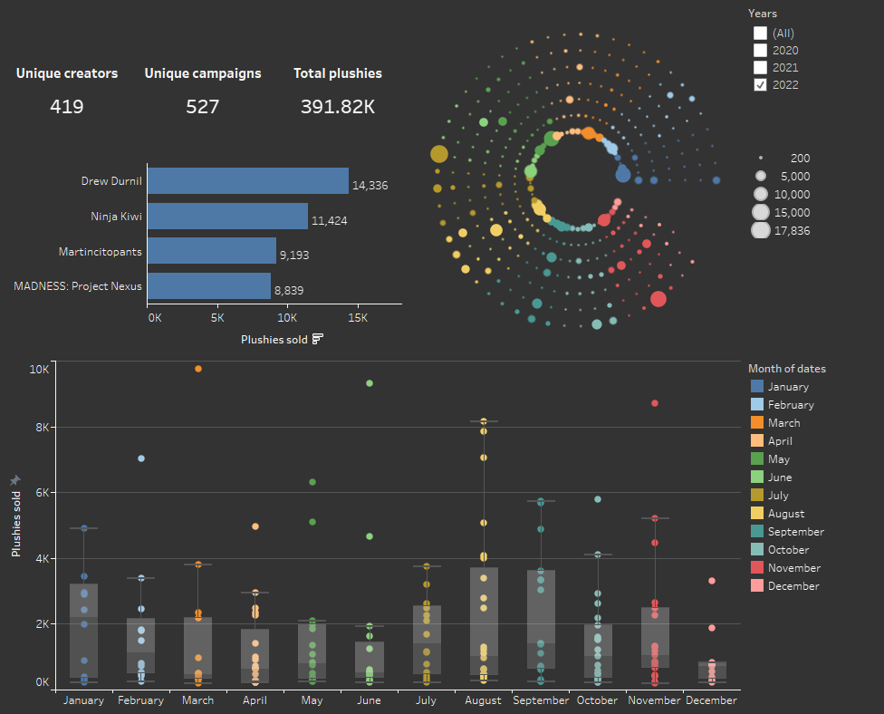

## Mini Makeship project 🚀

[Makeship](https://www.makeship.com/about-us) is a crowdfunding platform that enables creators to create unique products and experiences for their fans.

## Analysis 📊

Currently I am only gathering surface-level information about each campaign (num sold, creator, plushy name, date ended) 
since that is all that's available through the website. As a result, most of the analyses are surface-level as well.

I am currently working on incorporating creator statistics (i.e., YouTube subscribers, YouTube past 30 days views, etc)
using various social media APIs.

With internal data, it would be interesting to look at campaign velocity (i.e., the rate of growth of the campaign), 
creator category (Artist vs Gaming vs Lifestyle vs etc..), creator engagement, along with various other measures to
estimate campaign performance. 



## Requirements 📐

- Python 3
- Pipenv
- Chrome
- Tableau Reader

### Linux 🐧

1. Install chrome headless

```shell
sudo apt update

wget https://dl.google.com/linux/direct/google-chrome-stable_current_amd64.deb

sudo apt install ./google-chrome-stable_current_amd64.deb

# Check chrome version
google-chrome --version
```

2. Install and run pipenv

```shell
python3 -m pip install pipenv

python3 -m pipenv install

# Activate the environment
python3 -m pipenv shell
```

## Running 🏃

**To gather data:**

```shell
python3 -m pipenv shell

python get_data.py 2
```

**Visualization options:**

- Use Tableau Reader and open the premade `makeship.twbx` dashboard (interactive)
- Use/view `visualize.ipynb` to create some basic seaborn figures

## Data availability 📄

Data sources used include:

1. Past campaign information (https://www.makeship.com/shop/past)
2. Live campaign information (https://www.makeship.com/shop/featured)
3. Plushy information (https://www.makeship.com/products/_______)

- 1 and 2 and gathered statically after scrolling to the bottom of the page. Since this is a one-off project, I'm only gathering this data once, although it should be easy enough to create a selenium driver to automatically scroll and gather the data.

- 3 is gathered dynamically using selenium

